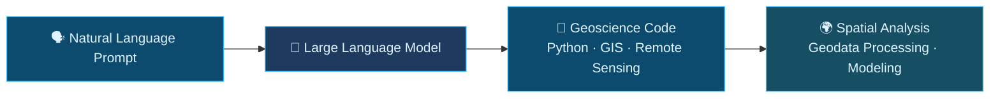

&nbsp;&nbsp;

&nbsp;&nbsp;

## 🧭 About Me

Hi, I'm **Ziqi Liu**, a Ph.D student at **Wuhan University** focused on the intersection of **Large Language Models** and **Geoscience**.

| | |
|---|---|
| 🎓 **Affiliation** | Wuhan University |
| 📧 **Email** | lzq677@whu.edu.cn |
| 🔬 **Research** | LLM-based Geoscience Code Generation |
| 🌍 **Interests** | Geospatial Intelligence · LLMs · Automated Code Generation · Remote Sensing & GIS |
| 💬 **Status** | Exploring the intersection of AI × Earth Science |

---

## 🔬 Research Direction

> Enabling researchers to interact with complex geodata pipelines using **natural language** — powered by Large Language Models.

---

## 🛠️ Tech Stack

**Languages & Frameworks**

**AI & LLM**

**Geoscience Tools**

**DevOps & Tools**

---

## 📊 GitHub Stats

| Stats | Languages | Streak |
|:---:|:---:|:---:|
|  |  |  |

---

## 🌱 Currently Working On

- 🔭 **LLM + Geoscience Code Benchmark** — Building evaluation datasets for geo-specific code generation
- 🧪 **Prompt Engineering for GIS Workflows** — Designing domain-aware prompts for spatial analysis automation
- 📦 **Geoscience Copilot** — An AI assistant for geodata processing pipelines

---

 

*"The Earth speaks in data — I help machines listen."* 🌍

